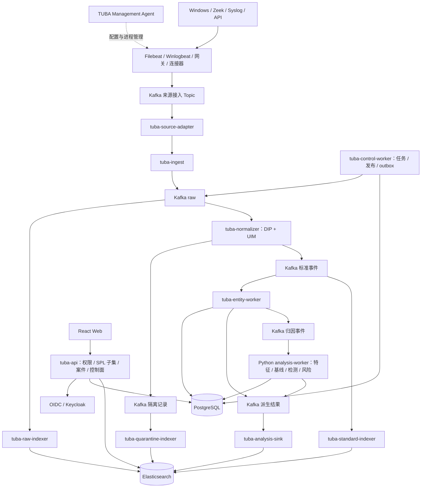

# TUBA 完整目标架构与实施基线

版本：1.0｜日期：2026-09-25｜状态：最终待实现基线（不是已交付声明）

配套任务：[IMPLEMENTATION-TODO.md](IMPLEMENTATION-TODO.md)。本文定义本轮完整目标，优先于旧文档中关于范围、服务拓扑、存储和部署的不同约定。机器合同与代码目前尚未全部符合本文，必须按 TODO 显式迁移，不得把文档更新当成实施完成。

采集与索引流程图：[collector-v4.html](diagrams/collector-v4.html)；旧版 [collector.html](diagrams/collector.html) 为历史图。

2026-09-27 采集方案 v2 已替换自研通用采集器路线，以 [COLLECTOR-DESIGN.md](COLLECTOR-DESIGN.md) 为准：Filebeat/Winlogbeat、Syslog 网关和专用连接器，由 TUBA Management Agent 管理；新增来源接入 Kafka Topic 与 tuba-source-adapter，复用 ingest、Raw、DIP/UIM。代码尚未完成替换。

Collector 远程注册、心跳、配置版本、升级目标与当前实现边界见 [COLLECTOR-CONTROL-PLANE.md](COLLECTOR-CONTROL-PLANE.md)。控制面首批服务端 API 已落地，Agent 管理客户端和二进制 OTA 尚未接通。

## 1. 目标、范围与决策

交付一套可在单机运行的 TUBA：采集 Windows Security、Zeek 等来源，完成可信接入、DIP 解析、UIM 标准化、证据保存、事件检索、账号/设备实体解析、窗口特征、基线、检测、异常、风险、案件、反馈与运营管理。每项功能一个运行实例；同一实例可以处理多个租户和多个 Kafka 分区。

单节点表示部署数量，不限制模块边界。首期允许全部组件部署于 248；采集组件运行于来源或汇聚主机。若沿用 247 的身份服务，通过配置连接，不依赖该主机才能完成标准安装。单机停机会整体中断服务，故障通过持久状态、缓冲及备份恢复，不承诺 HA。

| 决策 | 定版约定 |
| --- | --- |
| 技术分工 | Go：接入、标准化、实体解析、索引、API、任务控制；Python：特征、基线、检测及风险计算；React/TypeScript：控制台 |
| 基础设施 | 首期单 KRaft broker（RF=1）、单 PostgreSQL、单 Elasticsearch、单 OIDC 身份服务；反向代理统一入口。Kafka 集群只在可用性/容量目标要求时升级 |
| 执行方式 | TUBA 平台服务与来源主机 Management Agent 由统一 Launcher/CLI 管理；目录包包含锁定版本的 Filebeat/Winlogbeat，Linux/Windows 不注册 systemd/Windows Service |
| DIP/UIM | 逻辑独立、首期同一个 normalizer 进程；标准化在 Kafka 标准事件发布之前完成 |
| 消息语义 | 系统整体至少一次；目标上 Kafka 内部转换使用事务（当前单节点 profile 尚未交付，见 6.2）；跨 PostgreSQL/Kafka 使用 inbox/outbox；跨 ES 使用稳定键与版本约束 |
| 权威存储 | PostgreSQL 保存产品事务与可恢复计算状态；ES 保存事件及分析对象和查询投影；Kafka 为有限保留的传输/恢复日志 |
| 实体范围 | 首期 Account、Device；IP 为观测维度，人员归并不在首期范围 |
| 存储取舍 | 首期追加类对象采用确定性时间分区索引＋查询 alias，解决跨 rollover 幂等；不使用自动 rollover Data Stream 保存这些对象，详见第 8 章 |
| 安全 | 服务端绑定租户和 namespace，按权限授权；浏览器只访问 API；密钥不进入文档、Git、消息诊断字段 |
| 版本 | 沿用 TECH-STACK-BASELINE.md 的工程锁定入口；安装前核对实际可用制品，本文不另行声明软件版本已获验证 |

不纳入首期：跨地域 HA、通用 SOAR、任意 Python 插件在线执行、全量 Splunk SPL 兼容、图数据库、Flink/Spark、自动模型选择、无限期原文保存。完整架构覆盖扩展接口，首期检测按场景逐条交付。

## 2. 总体架构

图中的 Kafka 框是逻辑 Topic，同属一个 broker；ES/PG 框同属各自一个实例。API 创建任务，control-worker 调度；批量任务不在 HTTP 请求中执行。Raw 与标准化是同一原始消息的独立消费分支，不要求 Collector 双写 ES。

## 3. 服务与运行边界

| 运行单元 | 首期实例 | 输入/输出与职责 |
| --- | --- | --- |
| 反向代理＋Web 静态文件 | 1 | HTTPS、静态资源、API 路由、请求体限制；不负责最终租户授权 |
| tuba-collector（待实现） | 每来源主机 1 | Windows/Zeek 读取、持久队列、双游标、固定身份投递和失败恢复；多来源独立配额 |
| tuba-ingest | 1 | 来源凭证→可信原始信封→Kafka；大小、限流、来源授权、本地状态无关 |
| tuba-normalizer（新增） | 1 | raw→DIP 候选→UIM 标准事件/隔离；插件包加载与固定版本执行 |
| tuba-raw-indexer / tuba-standard-indexer / tuba-quarantine-indexer | 各 1 | 独立消费 raw、标准、隔离 Topic 并写 ES；各分支单独并发上限，防止相互阻塞 |
| tuba-entity-worker（新增） | 1 | 标准事件→Account/Device、归因、关系、分析输入；持久化 inbox、状态及 outbox |
| tuba-analysis-worker | 1 | 归因事件与任务→特征、基线、检测、异常、风险；内部模块分离，在线与批量队列隔离 |
| tuba-analysis-sink | 1 | 派生结果合同验证→ES 结果/投影；处理 revision 顺序和删除/撤回事件 |
| tuba-api | 1 | OIDC/RBAC、受控查询、实体/异常/风险/案件、来源及发布管理、任务创建、审计 |
| tuba-control-worker（新增） | 1 | 任务领取、租约、重试、取消、发布状态、outbox 投递、到期清理和巡检 |
| Kafka / PostgreSQL / Elasticsearch / Keycloak | 各 1 | 分别保存消息、事务与状态、检索对象、身份；独立数据目录和服务账号 |
| Prometheus / Grafana | 各 1 | 本地指标与告警；首期告警渠道通过运维配置，非业务发送接口 |

control-worker 可执行各模块 outbox 的通用发布器，但 payload 及业务状态由所属模块生成。发布器只能更改投递状态。Go 认证检测 CLI 保留为诊断工具，正式调度统一走 analysis-worker，禁止两个实现同时生产同一规则结果。

## 4. 可信接入与原始证据

### 4.1 来源注册与确认

来源注册对象包含租户、namespace、来源实例 ID、厂商/产品/dataset、身份空间、允许格式、配额、DIP 版本及发布包 ID。来源凭证存摘要或密钥引用；客户端不能通过正文覆盖可信字段。

可信 Raw 接口 `POST /api/v1/ingest/events` 保留供持有来源凭据的直接采集器使用。Beat 使用原生 Kafka 输出到来源专属接入 Topic；source-adapter 调用内部 `POST /api/v1/internal/ingest/beat-events`，ingest 根据 Topic 查询服务端已登记的来源上下文，并返回含 context、topic/partition/offset 和 payload hash 的 202 receipt。Beat 消息本身不具备可信租户/路由权限。Kafka ACL 自动编排、端到端故障验收和字段适配按 COL-01/03 继续实现。

202 仅表示可信 Raw Kafka 确认。Beat 的输出 ACK 只确认接入 Kafka，adapter 在匹配 receipt 后才提交输入 offset，ES 成功由索引阶段独立确认。source_position 区分来源位置与传输位置；Kafka offset 仅保证重读幂等，不能证明 Beat 跨 offset 重发已去重。详见采集设计第 3 节。RF=1 无副本保护。

旧 `/api/v1/events/authentication` 已删除，不提供兼容入口。所有来源必须登记并使用来源凭证调用 `/api/v1/ingest/events`，由可信来源上下文进入 raw Topic，再经 DIP/UIM 标准化。

### 4.2 原始信封与证据

原始信封包括 schema_version、raw_event_id、organization.id、namespace、source_instance_id、source_position、source_epoch、vendor 身份、received_at、release_id、payload、payload_hash、编码。确切 JSON Schema 由任务 C01 发布。默认单条上限 1 MiB；更大记录首期拒绝并让 Collector 留存，不截断为成功。

raw_event_id 使用带版本、长度编码的稳定输入：租户＋来源实例＋dataset＋重置代次＋采集位置。文件用文件身份与 offset，Windows 使用实例/频道/重置代次/RecordID。缺少稳定位置的 API 来源必须提供持久请求 ID。不能仅以正文 hash 去重两次真实发生的相同日志。

Raw 与 normalizer 消费同一 raw Topic。Raw ES 写入滞后不阻塞正常标准化，但必须有积压告警和保留窗口保护；证据未就绪时 API 返回“归档中”，不能返回不存在。Raw 的 retention 与标准事件分别管理；证据过期显示明确状态。

## 5. DIP 与 UIM Gateway

### 5.1 DIP

插件包由 manifest、解析器、映射规则、来源合同、ID 规则、样例和兼容依赖组成。首期内置受控执行器和声明式配置，禁止上传任意脚本获得主机执行权。插件安装只登记不可变版本；绑定来源才激活。

DIP 完成格式解析、来源检查、时间解析、字段提取、厂商映射、原生字段保留、event.id 和 raw 引用。一条 raw 可产生多条事件，使用稳定子记录标识区分 event.id；合法空输出必须产生带原因的处理结果，不得静默丢弃。

Windows 按事件语义区分登录账号、操作者、目标账号、成员和组；分别映射 user.*、user.target.*、group.*。Zeek 按 conn/dns/http/ssl 等 dataset 解释连接和协议语义。DIP 不决定物理索引，不把 user.id 改写为 entity.id，不从缺失日志中制造确定事实。

### 5.2 UIM

UIM 是 ECS＋TUBA 扩展的统一信息模型。Gateway 顺序为：来源合同→可信领域分类→公共/领域类型与语义合同→质量/能力→路由。删除或拒绝源端预设的可信 route/quality，按发布包重新生成。

| 输出 | 条件 | 去向 |
| --- | --- | --- |
| qualified | 最低领域语义成立，必要字段完整 | 标准 Topic 和 ES |
| partial | 核心语义成立，部分可选能力缺失 | 标准 Topic，记录 reasons 与 usable_for |
| invalid | 时间/核心语义等最低合同不成立 | Quarantine |
| unsupported | 格式/事件类型无适用合同 | Quarantine 的 reason_code；不混入合格事件 |

事件 outcome=failure 是行为结果。账号/设备标识不足按领域合同判断，不统一隔离；实体层对角色输出 unresolved。可选字段非法时保留原值证据并标记字段不可用，不任意改为零或当前时间。

首期领域为 authentication、session、iam、directory、network、dns、web、tls。一条事件只进入一个主领域，其余用途由 semantic_tags/usable_for 表达。最终索引路由只由可信 namespace、领域和存储代次决定。

### 5.3 旧 Pipeline 的迁移

`../implementation/technology-addons` 与 `../implementation/elasticsearch-storage`（从 product 根目录解析）为规则与样例来源，不直接代表 product 已实现。迁移 Source Pipeline→DIP，classifier/validate/router→UIM；ES 保留 Mapping 约束。新旧同样例在隔离 namespace 对照，批准来源切换后只保留一条生产路径。旧 `logs-ueba.ingress-*` 仅在旧链路迁移期间存在。

发布包固定 DIP、UIM、路由、Mapping、实体语义/身份空间、Data Model 和分析资产版本。raw 在接收时固定 release_id，重试不得临时改用 latest。

## 6. 消息合同与跨系统一致性

### 6.1 Topic 目录（目标约定）

| Topic | Key | 生产者→消费者 |
| --- | --- | --- |
| tuba.raw.events.v1 | tenant＋source_instance | ingest→normalizer、raw indexer |
| tuba.events.<domain>.v1 | tenant＋event.id | normalizer→event indexer、entity-worker |
| tuba.quarantine.v1 | tenant＋raw_event_id | normalizer→quarantine indexer |
| tuba.attributed.events.v1 | tenant＋entity.id | entity-worker→analysis-worker |
| tuba.analysis.results.v1 | tenant＋object_type＋object_id | entity/analysis outbox→analysis-sink |
| tuba.indexing.dlq.v1 | tenant＋delivery_id | indexer/sink→受控修复任务 |

上表列的是逻辑 Topic。部署时依 `contracts/events/topics.v1.json` 中的 `physical_name` 展开 namespace/source-context/domain；例如 `tuba.raw.events.v1` 映射到 `tuba.collector.<namespace>.raw.v1`，而来源 Topic 使用 `tuba.source.<source_context_id>.v1`。这样验证环境可按 namespace 隔离，同时逻辑消息合同保持统一。所有 Topic 首期 1 分区、1 副本，consumer 使用显式组名和手动提交。先以实测确认一个分区上限；增加分区是有状态迁移，不能在线随意改变实体 key 的归属。共享 Topic 的消费者覆盖完整流；tenant 过滤是可信路由/授权规则，不将其他租户正常消息送入 DLQ。

标准消息信封包含 schema_version、message_id、tenant、namespace、release_id、event_time、produced_at、trace_id、payload；message_id 与 event.id 区分，业务去重必须使用业务 ID。结果信封另含 object_type、object_id、revision、operation、generation、input_refs。业务兼容性看 Schema/合同 major；发布版本不等于 Topic major。

### 6.2 一致性协议

以下是目标协议。当前 `topics.v1.json` 的已实现单节点 profile 明确关闭 Kafka transactions，normalizer 使用至少一次投递与手动 offset commit；在 transactional producer、read-committed 消费和 fencing 完成验收前，不得把下列事务方案描述为已交付能力。

1. **Normalizer：**一个 Kafka 事务包含本批全部标准/隔离/过滤结果及输入 offsets；消费者 read_committed。生产者事务 ID 按工作槽位固定，重启 fencing，事务大小/耗时有上限。现有 Kafka 客户端若不支持所需事务，先替换或完成受验证的适配，不能仅加配置宣称完成。
2. **实体/分析状态：**一个 PostgreSQL 事务写 inbox 唯一键、状态/结果、outbox 和 next_offset。随后提交 Kafka offset。恢复从 PG checkpoint 定位；Kafka offset 只作运输提示，PG 事务是该状态消费者的恢复权威。rebalance 后需持有分区租约及 fencing token 才可写状态。
3. **Outbox：**发布 Kafka 成功后标记 sent；崩溃可重复发布，消费者按业务对象及 revision 去重。未投递记录不可被 retention 清理。多个 outbox 发布器按聚合键有序领取，sink 同时用 revision 防止乱序回退。
4. **ES sink：**逐条确认 bulk 结果；成功、等价重复或永久失败记录已可靠进入 DLQ 后才能推进连续 offset。429/5xx/网络错误重试并背压，不将暂时不可用当永久坏数据。
5. **无全局事务：**ES 与分析独立消费，允许短暂可见性差异。API 显示计算、索引、证据状态及更新时间；不因分析已产出就声称证据已可检索。

DLQ 只含必要诊断及受控原始引用，避免复制敏感原文。错误类别、阶段、首次/末次失败、重试次数、输入位置、合同版本必须可查。无法写 DLQ 时保持 offset 未提交。

## 7. 实体、特征、基线、检测和风险

### 7.1 实体与归因

M2 的实体主键由 tenant＋entity_type＋authority＋canonical_key 确定，规范化算法版本固定。AD SID、设备稳定 ID 优先；用户名/FQDN 等弱标识须有可信作用域及允许规则。IP、hostname 不自动等同于设备强身份。

一个事件产生一份多角色 attribution，记录每个角色 resolved/unresolved/ambiguous、候选、证据和解析快照。relation 只在端点及语义满足时生成，使用 [valid_from, valid_to) 表达有效时间。PG 保存解析必需的可恢复状态和唯一性约束，ES 保存实体、归因、关系的查询投影；权威时态记录与投影通过 revision/outbox 对齐。

同一事件可按目标角色生成多条 attributed 输入，key=tenant＋entity.id；去重键包含 event.id、role、entity.id、resolution_snapshot。无法归因的事件仍可检索，允许事件级检测以稳定 event.id 为分组键消费。禁止通过 user.id 字符串直接累计跨来源用户风险。

### 7.2 特征

每个特征声明领域、角色、所需字段、质量门槛、实体类型、窗口、统计方式、迟到策略和版本。归因输入提供必要标准字段与事件引用，避免每条消息临时 join ES。窗口主键为 tenant＋entity＋feature/version＋window＋generation，输入 inbox 消除重复贡献。

事件时间采用 @timestamp；received_at 与 processed_at 分开。按活跃分区水位取最小值闭合窗口；空闲分区有明确 idle 策略，未来时间异常不能推进水位。默认迟到宽限先配置为 10 分钟（待场景验证），窗口内更新 revision，超过范围进入回填任务，不静默丢弃。

### 7.3 基线与检测

基线任务使用截止时间前的特征，避免未来信息泄漏。保存样本范围、样本量、训练参数、算法版本及评估结果；不足时为 cold_start，允许规则检测，不输出伪造的模型置信度。基线版本不可变；PG 发布事务保存当前引用并经 outbox 更新 ES 查询投影，计算任务固定快照。

首期至少交付认证失败后成功、认证失败聚集两条确定性规则，及一个具有冷启动和最小样本约束的统计基线场景。其他网络/账号变更检测通过 registry 扩展。异常包含稳定 ID、实体、时间范围、规则/模型版本、特征、解释、证据、分数及状态。

异常 ID 不包含临时 run_id。迟到修正使用相同 ID 和递增 revision；重算发现原异常不成立时必须输出 retracted，不只覆盖仍存在的结果。新模型版本生成新结果，生产选择由 active generation 决定。

### 7.4 风险、案件和反馈

异常产生不可变风险贡献事件；去重键包含异常 ID、规则版本及修订。撤回/修正产生补偿贡献，不重复累加。风险按实体、有效时间、关联去重和可配置衰减函数计算，保存贡献解释及计算版本。时间衰减由周期任务推进，不能仅在新异常到来时更新。

案件及案件操作以 PostgreSQL 为唯一事务权威，使用 optimistic version 和 Idempotency-Key；ES 案件索引仅在确有全文检索需要时作为异步投影。案件引用异常/实体/事件，保存取证快照或保留策略，避免事件过期后结论失去依据。默认人工建案，自动建案需独立规则、去重键及启停配置。

反馈写入受审计记录，经离线评估后发布新规则/基线，不直接在线修改模型或历史事实。

## 8. Elasticsearch 存储定版

### 8.1 为什么本版采用确定性时间索引

此前建议 Data Stream＋定位账本；本次完整设计选择更简单且可实现的首期方案：**确定性日期分区普通索引＋受控只读 alias**。同一业务对象的重试始终命中相同物理索引，无需逐事件 PG 定位表，也不依赖 rollover 后的跨 backing index 去重。

逻辑查询名继续使用 logs-ueba.<domain>-<namespace>，但它是 alias，不是 Data Stream。若目标环境已有同名 Data Stream，必须新建隔离 generation/alias 并迁移查询，禁止原地同名创建。248 先前快照为空不作为安装时的断言，安装程序重新探测。

### 8.2 索引目录

物理名统一为 `<logical>-g<generation>-<UTC日期或分桶>`，namespace 由注册表限制字符集、长度和合法值。新 generation 先用私有 alias，验收后更新查询目录。对普通查询只暴露 active generation。

| 对象 | 逻辑查询入口 | 物理分区、写入与权威 |
| --- | --- | --- |
| 原始证据 | logs-ueba.raw-<ns> | 物理索引 `tuba-v1-raw-<ns>-g1-<UTC日期>`；稳定 received_at 的 UTC 日期；create；完整原文受限访问 |
| 八个领域事件 | logs-ueba.<domain>-<ns> | 物理索引 `tuba-v1-uim-<domain>-<ns>-g1-<UTC日期>`；DIP 确定并固定的事件 UTC 日期；create；不可变标准事件 |
| 隔离 | logs-ueba.quarantine-<ns> | 原始 received_at 日期；create；同输入＋规则快照＋失败阶段稳定 ID |
| 归因 | ueba-attributions-<ns> | 原事件日期＋解析快照；版本化结果 |
| 关系 | ueba-entity-relations-<ns> | 关系事实有效日期/固定分区键；PG 时态权威的投影 |
| 实体当前状态 | ueba-entities-<ns> | 固定索引；以 entity.id 和 revision 更新 |
| 特征 | ueba-features-<ns> | window_start 日期；业务键＋revision |
| 基线版本 | ueba-baselines-<ns> | 版本化不可变索引；current 引用来自 PG 发布记录 |
| 异常 | ueba-anomalies-<ns> | 固定 detection window_start 日期；稳定 ID＋revision＋retracted 状态 |
| 风险贡献 | ueba-risk-events-<ns> | 固定贡献事件日期；不可变；补偿使用新贡献 ID |
| 当前风险 | ueba-entity-risk-current-<ns> | 固定索引；entity.id＋revision |
| 案件 | PG cases 及关联表 | ES 投影可选，不建立第二个案件事务权威 |

日期键属于合同，不能根据重试当天重新计算。无事件时间的隔离使用固定采集日期。修订改变分区关键时间时不能普通 upsert，必须生成新 generation 或显式撤回旧对象。

输入 ID 相同且 hash 一致的 409 才视为等价重复；内容冲突进入冲突隔离。更新对象使用 PG 单调 revision 与 ES external version 防止旧值覆盖新值；同 revision/hash 不一致必须告警。revision 由业务对象所有者在状态事务内生成，不使用机器时钟。

### 8.3 Mapping、分片与保留

标准 Mapping=公共组件＋领域组件；字段类型由版本化 Schema/组件模板共同生成或交叉检查。正式字段显式声明，未知原生属性进入 flattened vendor.payload；根级动态字段拒绝。event.original 只在 Raw 保存，标准事件保留 raw_event_id。

默认每个物理索引 1 主分片、0 副本。仅在有数据时创建日期索引，限制总分片预算；低流量领域可按配置采用月分区，但策略随 generation 固定。namespace 首期可按租户隔离；未来共享 namespace 仍强制 organization.id 过滤。

初始保留目标：Kafka raw/标准/归因/结果 7 天，Quarantine/DLQ 14 天；ES Raw 30 天、标准/归因/关系 90 天、隔离 30 天、特征 180 天、异常与风险贡献 365 天；当前状态随对象生命周期维护，基线按引用保留。均是待容量校准的配置默认值，不是法律或业务留存承诺。

清理任务按索引分区到期整索引删除；首次版本不使用 rollover，不自动把仍可迟到更新的索引设为只读。删除前检查任务租约、案件保留及备份策略；已过期索引不因消费重试被偷偷重建。越过保留范围的消息进入过期处理状态/受控归档恢复任务。

## 9. PostgreSQL、控制面与查询

### 9.1 PostgreSQL 逻辑数据模型

以下是目标表组，具体复用/扩展现有 migrations，名称不表示均已存在：

| 表组 | 约束与用途 |
| --- | --- |
| organizations / identities / memberships / roles / permissions | 当前授权权威；tenant 外键与组合唯一约束 |
| sources / credential_metadata / namespace_bindings | 来源凭证、来源实例、DIP/身份空间/配额绑定 |
| assets / asset_versions / release_bundles / release_bindings | 不可变资产、依赖、哈希、灰度与激活指针 |
| entity_registry / identity_bindings / attributions / relations | 身份与时态解析权威；强标识租户内作用域唯一 |
| jobs / job_attempts / leases | 回放、回填、训练、导出、清理；重试与 fencing |
| inbox / processor_state / checkpoints / outbox | 状态消费原子性；按消费者/分区管理并分区清理 |
| analysis_runs / baseline_publications / result_revisions | 分析审计、基线引用、结果修订及撤回 |
| cases / case_events / case_evidence / analysis_feedback | 案件事务、证据与反馈 |
| audit_events / idempotency_records | 追加审计及请求去重 |

高频 inbox/checkpoint/state 必须批量事务、有界状态和 retention。保留期覆盖允许重放窗口；窗口外回放进入新 generation，不能依靠已清除 inbox 保证去重。PG 数据增长/事务延迟达到阈值时先调整批量和保留，再评估专用状态存储，不首期引入 Redis。

### 9.2 发布与任务

资产生命周期：draft→validated→staged→active→retired。发布包含依赖解析、哈希校验、样例结果、操作者和审计；旧版本不原位修改。normalizer/worker 启动拉取完整发布包并缓存不可变文件，运行中的同批/同任务固定快照。控制面暂时不可用时已加载版本可继续，新发布拒绝。

任务生命周期：queued→running→succeeded/failed/cancelled；attempt 独立记录。租约过期可重领，所有持久更新检查 fencing token。取消在批次边界生效，已落地结果不得伪装为未执行；回放 generation 可丢弃，线上补偿按业务协议完成。

### 9.3 SPL 与数据模型

查询链：用户请求→OIDC/RBAC→Data Model/Dataset 绑定→服务端注入 tenant、namespace、generation、质量条件→逻辑计划→ES 适配器→结果脱敏与审计。

首期 SPL 子集限定字段筛选、布尔条件、时间范围、排序、分页、计数/分组聚合；必须列出支持语法和错误，不承诺完整兼容。禁止透传任意 DSL、脚本或物理索引。普通查询有时间/行数/桶数/超时限制；导出为异步任务，下载重新授权并设置有效期。

## 10. 前端与 API 产品面

| 页面 | 核心能力 |
| --- | --- |
| 总览 | 接入/质量/索引/分析新鲜度、实体风险与异常摘要；明确数据时间范围 |
| 数据源与 DIP | 来源健康、采集检查点、绑定插件版本、配额、样例解析 |
| UIM 与数据质量 | 领域合同、字段覆盖、partial 原因、隔离详情和受控回放 |
| 事件查询 | 领域/SPL 子集、标准字段、受授权原文、血缘与处理状态 |
| 实体 | Account/Device、身份标识、归因、关系、特征、基线、异常和风险解释 |
| 分析管理 | 特征/规则/基线版本、启停、冷启动、任务、评估与回填 |
| 调查与案件 | 异常证据、风险贡献、建案、指派、流转、反馈 |
| 平台管理 | 成员/权限、发布、任务、审计、运行健康和备份状态 |

新增 API 先更新 OpenAPI 与错误码，再更新 UI；异步接口返回 job_id。浏览器不持中间件凭证，UI 隐藏按钮不能替代后端授权。API 返回对象版本和数据就绪状态，避免异步投影造成误导。

## 11. 单节点部署与运维

### 11.1 目录和网络

建议 `/opt/tuba/releases/<version>` 保存只读程序，`/opt/tuba/current` 指向当前版本；`/etc/tuba` 保存配置与受限凭据；`/var/lib/tuba` 保存 spool、插件缓存、任务临时文件；Kafka/PG/ES 各自独立持久目录。现有 248 路径可通过配置接入，升级不搬迁数据库目录。

公网/用户侧仅开放反向代理 HTTPS；ingest 可同域独立路径或专用内网入口。Kafka、PG、ES、指标端口只绑定 loopback 或受控内网，不直接面向用户。来源跨主机与身份回调使用 TLS；单机 loopback 可在隔离配置中使用本地连接。各服务单独账号、Kafka ACL、ES API key、PG 最小角色。

密钥首期由受限权限的配置/环境注入，平台服务以专用非 root 账号运行；Management Agent 凭据和各来源 Beat 写入凭据分离并分别保护。Launcher 负责将配置传给受管进程，禁止凭据进入命令行参数、一般日志和通用组件包。后续可接 Vault。Keycloak 使用独立数据库/角色。备份包含凭据恢复流程，但禁止明文密钥进入一般日志和制品。

### 11.2 启动、探针和背压

顺序：PG/Kafka/ES→迁移及 Topic/模板/合同安装→身份服务与发布包→sink/indexer→normalizer/entity/analysis/control→API/ingest/Web。所有服务支持重连，不能只靠启动顺序保证依赖健康。

live 只检查进程；ready 检查本服务必需依赖、已加载合同、容量及发布版本。ES 故障不应使仍能可靠写 Kafka 的 ingest 自动不可用；Kafka 剩余保留窗口或磁盘达到保护阈值时停止接入，Management Agent 根据 Beat 队列状态告警和背压。缓冲、bulk、任务队列和内存状态全部有上限。

平台服务与采集管理代理通过 Launcher/CLI 管理进程、优雅停止、重启退避、资源限额和轮转日志，不要求 systemd/Windows Service。采集组件各自维护独立 registry/bookmark 与已验证的持久队列；升级检查状态格式兼容。备份、任务与在线计算分别限流。

### 11.3 容量与初始监控

Kafka 首期单机单 broker、关键 Topic 单副本（RF=1），用于开发、验证或接受 broker 故障期间平台中断的部署；不具备 broker/主机故障数据冗余。生产若要求单 broker 故障后继续写入且保留已确认数据，最低目标为 3 个独立故障域 broker、关键 Topic RF=3、`min.insync.replicas=2`、producer `acks=all`，并验证 ISR、容量与故障恢复。按 RPO/RTO、峰值日量、保留天数和可用故障域评估升级；不要仅为远程 Collector 管理引入集群。单机多 broker 仍不能抵御主机/磁盘整体故障。

不在缺少主机资源及流量测量时承诺固定 EPS。安装预检记录 CPU、内存、磁盘、IOPS、日事件量、平均原文/标准事件大小；按下式估算后再确定 retention：

`Kafka 容量 ≈ 日消息字节 × 保留天数 × 副本数 × 安全系数`

`ES 容量 ≈ 各对象每日写入量 × 实测索引放大系数 × 保留天数 × (1+副本数)`

预留至少 30% 数据盘空闲空间作为初始运维目标；批量/并发从小配置开始测量。PG、ES、Kafka 争用同一磁盘是单机主要限制，达到容量预算先缩短非必要保留或扩磁盘，不靠无限增大内存缓冲。

监控覆盖接收/拒绝、raw 归档 lag、DIP/UIM 通过率、字段缺失、各 consumer lag、outbox 年龄、ES 拒绝/索引冲突、状态库延迟、watermark、迟到量、实体 unresolved、基线冷启动、结果撤回、API 延迟及备份年龄。指标禁止以 event.id/user.id 为标签。

初始告警：依赖失败立即告警；outbox 最老未投递超过 5 分钟；关键链路 lag 超过 5 分钟；磁盘使用率 70% 警告、85% 保护评估；预计消息过期时间小于恢复预算立即阻断相关接入。阈值经容量验收调整，SLO 未实测前标记为目标。

### 11.4 故障与恢复

| 故障 | 行为与恢复 |
| --- | --- |
| Kafka 不可用 | ingest 返回 503，Beat 持久队列/网关缓冲；事务消费者停顿；恢复后重试 |
| ES 不可用 | sink 背压；Kafka 保留；分析可继续但页面显示检索滞后 |
| PG 不可用 | 状态消费者停顿，API 事务拒绝；已发布 normalizer 在可信配置有效期内继续 |
| 单个坏事件 | 业务隔离/技术 DLQ，保留原因与引用；不拖死整个分区 |
| 身份服务不可用 | 不能新登录；已有 token 仅在本地有效签名缓存及 PG 授权正常时按过期策略使用 |
| 主机宕机/磁盘损坏 | 进程恢复或从异机备份恢复；本机副本无法提供保护 |

PG 定期基础备份＋WAL 归档，ES 使用 snapshot，Keycloak 数据/配置与发布包同样备份到异机或独立备份介质。本地另一个目录不算灾备。恢复顺序为配置/身份→PG→ES→Kafka/Topic/ACL→来源映射→消费者→接入；根据 PG checkpoint、Kafka 最早 offset 和 ES snapshot 建立差异区间，缺失事件从可信 Raw 或来源受控补采。

checkpoint 超出 Kafka 保留范围时必须暂停并生成缺口任务，禁止自动跳到 latest。跨库备份不是原子快照，恢复清单记录每个系统的时间点及水位。目标 RPO/RTO 由实际备份频率和演练确认；无异机备份时明确只能承诺进程重启恢复。

### 11.5 Collector 远程管理

TUBA Management Agent 运行于来源或汇聚主机，统一 CLI 监督 Beat/网关/连接器，不注册 systemd/Windows Service。Agent 主动通过开发 HTTP 访问管理 API，30 秒心跳与 ETag 轮询；平台保存安装、组件、来源、配置与审计。Kafka 管理通道不新增；数据面新增来源接入 Topic，来源使用精确 ACL 和独立凭据。生产 TLS 按 O03 实施。

服务端已实现一次性 enrollment、agent bearer 凭据摘要存储、租户内列表、心跳、追加配置版本、ETag poll 和禁用；当前 ZIP 客户端尚未接线，远程心跳/配置尚未端到端生效。二进制更新应后续通过独立 Launcher/Worker 实现 artifact 哈希与签名验证、分批灰度、健康确认和自动回滚；当前没有可用 OTA。完整细节与阶段状态见 [COLLECTOR-CONTROL-PLANE.md](COLLECTOR-CONTROL-PLANE.md)。

## 12. 回放、回填与升级

同版本消息重试保持 event.id、日期分区及业务键。语义规则改变时创建新的 generation，在隔离索引/消费组/状态空间重放；避免新旧语义同时进入线上风险计算。任务固定时间范围、输入快照、release_id、输出 generation 和预计数量。

切换流程：停止旧来源分配→记录 raw 分区边界→新版本从确定边界处理，历史重建补至切换水位→检查数量/质量/索引/分析水位→原子更新 PG active generation→查询和在线计算按该代次恢复。任务必须在切换水位追平后才激活；旧 generation 保留回滚窗口。对多个 ES alias 的操作只承担投影更新，PG 发布指针为唯一激活权威，期间 API 读取该指针对应物理代次，避免跨 alias 混读。

回滚切回旧版本/代次并补处理停用期间的 raw，不只切程序软链接。迁移使用 expand→migrate→contract，旧字段/旧 Topic 保留兼容期，破坏性删除作为独立维护操作。

## 13. 后续多节点扩展

| 组件 | 本期预留 | 扩容时必须完成 |
| --- | --- | --- |
| ingest/API | 无本地会话；来源/授权在 PG | 负载均衡、分布式配额/缓存失效策略 |
| normalizer/indexer/sink | 稳定消费组、有限并发、事务 fencing | 增加分区/副本，容量与再均衡验收 |
| entity/analysis | PG checkpoint、租约、业务键状态 | 分区迁移、实体重分配、状态再分片与顺序验证 |
| control-worker | SKIP LOCKED 领取任务、租约与 token | 多实例故障抢占与重复调度验证 |
| Kafka | endpoint 配置化、复制参数独立 | 多 broker/控制器、ISR 策略、机架/故障域 |
| ES | 模板、alias、代次与查询目录 | 副本、节点角色、分片预算和冷热资源 |
| PG | 事务、唯一键、outbox 可恢复 | 主备、连接入口、故障切换及备份演练 |
| 身份/Web | 标准 OIDC、静态资源 | 身份服务 HA、反向代理冗余 |

首期不为可能的扩容拆出大量微服务；扩容不能改变事件、实体、结果的业务 ID 规则。

## 14. 当前复用与待实现边界

| 已有入口/资产 | 本轮结论 |
| --- | --- |
| cmd/tuba-ingest、internal/event | ingest 仅接收已登记来源的 raw 信封；internal/event 仍供标准事件消费与分析使用 |
| cmd/tuba-*-indexer、internal/sink | raw、标准、隔离索引由独立消费者负责；需多对象路由、确定性时间索引、冲突处理 |
| python/tuba_analysis | 已有认证规则、水位、checkpoint 基础；需事务状态/outbox、实体归因、特征/基线/风险模块 |
| cmd/tuba-analysis-sink | 已有异常结果基础；需多对象、revision、撤回及代次支持 |
| internal/control、internal/api、web | 已有 OIDC、RBAC、案件、调查基础；需来源、资产、实体、质量、查询和运营管理 |
| 根目录及 implementation 设计 | 可复用术语、Windows/Zeek 规则和实体定义；迁移到 product 合同后才成为生产能力 |
| deploy/Helm 与历史 M0–M5 记录 | 保留为原认证纵切证据；不能作为本目标已完成的证明 |

本轮只修改文档。部署快照、先前运行状态与 README 的“已完成”不等于此架构可用；各项实现与验收见 TODO。

## 15. 完成交付标准

1. 每条确认接收的记录能查到持久位置、处理结果和原始引用；过滤与失败都有统计和原因。
2. Windows/Zeek 八领域完成来源→DIP→UIM→检索；坏数据、重复、乱序、重启、回放有确定行为。
3. Account/Device 多角色归因可解释；特征、基线、异常、风险和案件能追溯到同一事件及版本。
4. 租户隔离覆盖列表、详情、聚合、导出、原文、任务、回放和内部对象查询。
5. 单节点安装、升级、回滚、备份恢复和断点恢复有可执行手册及验收证据。
6. 合同、OpenAPI、Mapping、数据库迁移、UI 和本文无冲突；TODO 关闭必须附实现与验收证据。

## 16. 设计依据

- [统一名词解释](../../TUBA-统一名词解释.md)
- [DIP 解析流程与字段映射](../../DIP解析流程_UIM字段映射.md)
- [双实体目标设计](../../implementation/entity-resolution/UEBA双实体架构设计.md)
- [既有 ES 存储制品](../../implementation/elasticsearch-storage/README.md)
- [现有产品状态](../README.md)、[安全模型](SECURITY-MODEL.md)、[分析实现说明](ANALYTICS.md)

取舍说明：继承来源/DIP/UIM/实体/控制面语义；调整标准化执行位置、单节点部署方式、时间分区存储及状态一致性协议。本文是需要实现的明确目标，历史制品应迁移适配，不能未经比较直接覆盖生产配置。
